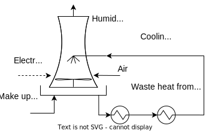

# Cooling Tower {-}

```{rosmose coolingtower}
! OSMOSE ET coolingtower
```

The industrial processes usually need to reject a large amount of waste heat as byproduct. The source of this residual heat can be the exothermic chemical reactions occurring in reactors or combustion chambers, as well as other dissipative components that partially degrade electricity into heat, e.g. intercooled compression systems or stirrers. The resulting hot streams need to be cooled down, but in some situations, those streams might not be further able to exchange heat with other process streams for internal heat recovery. Therefore, the excess heat removal must be achieved using auxiliary fluids, such as air or water. The choice between air or water cooling depends on factors like the temperature requirements, cost, and availability of resources. 

In the case of air coolers, the air can be put in direct contact or used in a heat exchanger to remove heat from the process streams. Forced convection is maintained by the circulation of cold air using fans. On the other hand, in a water-based cooling system, circulating water collects the waste heat from industrial processes and is then treated in a cooling tower. The cooling tower is a specialized heat and mass exchange equipment in which the hot circulating water is sprayed and brought into contact with fresh air in order to reduce the water temperature. As this occurs, a small volume of water is evaporated, reducing the temperature of the water being passed through the tower. The cooled water is pumped back to the process equipment, where it absorbs heat, then it is pumped back to the cooling tower to be cooled once again. 


```{r coolingtower, out.width='80%', fig.align='center', fig.cap='Cooling tower unit structure'}

```

In the cooling tower, return water enters at 30°C and reduces the temperature by evaporative cooling up to 15°C. The temperature difference is important to determine the flow of the circulating water, considering the enthalpy change of water at the specified pressure and temperature. The cooling tower can achieve lower temperatures than the intake air thanks to the water evaporation effect, which drops the system temperature from the dry to the web bulb temperature. The latter is a function of the former temperature and the relative humidity, and can be found using psychrometry charts. Considering the cooling tower supply and return temperatures, and the heat removal capacity `Cool_Qmax`, a single cold stream can be associated to the cooling tower unit. In addition, both recirculation pumps and forced draft fans consume electricity at a ratio of around 0.021 kWe per kWt [REF]. 

These and some other financial parameters are summarized in the following chunk of code, whereas the commentaries provide further details on the meaning and relevance of each term. For most industrial applications, some parameters of the cooling tower model could be set as default.


```{rosmose} 
Cool_Tin = 15 [C] # Cooling tower outlet temperature 
Cool_Tout = 30 [C] # Cooling tower return temperature 
Cool_Qmax = 1000 [kW] # Cooling tower reference heat load
Cool_Elec = 0.021 [kW/kW] # Cooling Tower electricity input
dtmin_liq = 5 [C] # delta Tmin of the cooling water (w/ liquid streams)
deltaH = 62.8 [kJ/kg] # Enthalpy change for cooling water 1 bar, 15-30°C
Tdrybulb = 20 [C] # Dry bulb temperature
RelatHum = 40 [%] # Relative humidity
Twetbulb = 12.17 [C] # Wet bulb temperature

# Economic parameters
n = 40.0 [yr] # Lifetime of a cooling tower
i = 0.06 [-] # Interest rate
CEPCI_2020 = 596.2 [-] # Actual CEPCI
CEPCI_2008 = 575.4 [-] # CEPCI 2008
```

Based on the previous parameters, it is possible to calcualte the total power demand for the reference cooling capacity `E_ref_CT`, the temperature difference `deltaT_CT`, the approach temperature difference of the cooling tower used in the cost estimation `Cool_Tin-Twetbulb`, and the circulating water flow `water_flow` and makeup flow `watermu_CT`. Finally, the annualization factor can be determined based on the assumed life time of the energy technology and the interest rate adopted to calculate the annualized investment cost.

```{rosmose} 
E_ref_CT = %Cool_Elec%*%Cool_Qmax% [kW] # Electricity consumption 
deltaT_CT = %Cool_Tout%-%Cool_Tin% [C]
approach = %Cool_Tin%-%Twetbulb% [C]
water_flow = %Cool_Qmax%/%deltaH%*3600 [kg/h] #water flow rate
watermu_CT = 0.000851*%water_flow%*(%Cool_Tout%-%Cool_Tin%) [kg/h] #makeup water in the CT system

# Economic parameters of the air separation unit (ASU)
Annuity = (%i%*(1+%i%)**%n%)/((1+%i%)**%n%-1) [-] #annualization factor
CTCost = 746.49/0.066*((%water_flow%/1000)**0.79)*(%deltaT_CT%**0.57)*(%approach%**-0.9924)*(0.022*%Twetbulb%+0.39)**2.447 [Euro]
Cinv2_CT = %CTCost%*(%CEPCI_2020%/%CEPCI_2008%)*%Annuity% [Euro/y]
```

<!-- ## With this chunk of code, the input and calculated parameters can be displayed{-} -->
<!-- ```{rosmose} -->
<!-- : TAGS DISPLAY_TAGS [nvuD] -->
<!-- ``` -->


**Layers of the Cooling Tower ET**

The concept of layers in ROsmose language is equivalent to pipes through which the mass and resources balances are closed. For instance, the electricity consumed by the cooling tower unit (in kW) is imported through the `Electricity` layer from a electricity supply grid located in the market model. In turn, makeup water consumed is supplied through the water layer by the water grid. These layers can be defined as shown in the following table:


```{rosmose} 
: OSMOSE LAYERS coolingtower

| Layer     | Display name | shortname | Unit | Color |
|:----------|:-------------|:----------|:-----|:------|
|Electricity|Electricity   |elec       |kW    |yellow |
|water      |Water         |water      |kg/h  |blue   |
```

**Units of the coolingtower ET**

The model of the cooling tower unit consists of a single unit, the `CoolTower` unit, which is an utility unit. It means that its size (continuous) and existence (binary) can be regarded as optimization variables used to minimize the electricity and water consumpiton or any other targets. To this end, other parameters of this unit, such as the lower `fmin` and upper `fmax` sizing bounds, must be specified in the Parameters tables shown next. Other operating costs (`cost1`:fixed, in Eur/y, `cost2`:variable in Eur/kWh/y or Eur/kg/y) and investment costs (`cinv1`:fixed in Eur/y; `cinv2`:variable in Eur/kW/y or Eur/kg/y) can be also specified.

```{rosmose} 
: OSMOSE UNIT coolingtower

| unit name |type   |
|:----------|:------|
| CoolTower |Utility| 
```


**Parameters of the Cooling Tower unit**

```{rosmose CoolTower_params}
: OSMOSE UNIT_PARAM CoolTower

|cost1  |cost2  |cinv1  |cinv2      |imp1   |imp2   |fmin   |fmax   |
|:------|:------|:------|:----------|:------|:------|:------|:------|
|0      |0      |0      |%Cinv2_CT% |0      |0      |0      |100    |
```

**Cooling tower unit resource and heat streams**

Finally, the mass and resource streams of the `coolingtower` unit associated to each relevant layer are defined. It must be carefully inserted each one of the `%tags%` defined in the previous chunks. It is important to define the direction of the mass or resource streams from the perspective of each unit. For instance, electricity and makeup water are consumed in the unit (i.e. direction is `in`). It is important to highlight that the layer for the heat stream balance is not explicitly defined, since a `DefaultHeatCascade` is already implemented for all the units in Rosmose. The heat stream is defined as a single stream with source and target temperatures, and a respective heat flow (calculated as `H_{out}-H_{in}` in kW). This utility stream is used to balance the cooling demands of the processes and to apply the optimization routine that minimizes the energy requirement (MER) by maximizing the waste heat recovery.


*Resource Streams*
Defining the resource streams

```{rosmose CoolTower_rs}
: OSMOSE RESOURCE_STREAMS CoolTower

|layer      |direction|value                |
|:----------|:--------|:--------------------|
|Electricity|in       |%E_ref_CT%           |
|water      |in       |%watermu_CT%         |
```

*Heat Streams*
Defining the heat streams

```{rosmose CoolTower_hs}
: OSMOSE HEAT_STREAMS CoolTower

|name           |Tin        |Tout       |Hin |Hout          |DT min/2       |alpha  |
|:--------------|:----------|:----------|:---|:-------------|:--------------|:------|
|cooltowerheat  |%Cool_Tin% |%Cool_Tout%| 0  | %Cool_Qmax%  | %dtmin_liq%   |1      |
```

## Visualization of CoolingTower {-}


*References*
1. https://spxcooling.com/coolingtowers